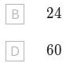

2. Achild arranges 5 blocks in a row. Two blocks are painted blue, one is painted red, one is painted green and one is painted white. How many possible patterns of colours are there if the two blue blocks are next to one another?

A20 C120

