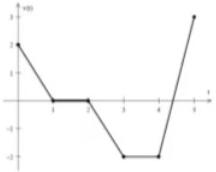

8. The accompanying diagram shows the graph of t

ag Gndnonltntnt foto etins in ni timinaial t paride hevelcity in $\frac{a} {a}$ fora paticle moving along averical line
in

() moving upward? (i)l moving downward? (imn at rest?

bsate heaclraiono te ridleat te Specified times. Include units.
() $t=0 . 7 5$ secs
() $t=4 . 2$ secs

