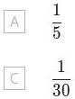
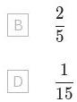

3. Mr an Mrs Brown and thei four hcitren go to the cinema. They are randomy
allocated six adjacent seats in a single row. What is the probability that the four children are allocated seats next to each other?

