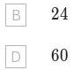

. Ain rangs bikn na om bok a ant blue on spaited ed,one is painted green and one is painted white. How many possible patterns of colours are there if the two blue blocks are next to one another?

A 20 C $1 2 0$ 

